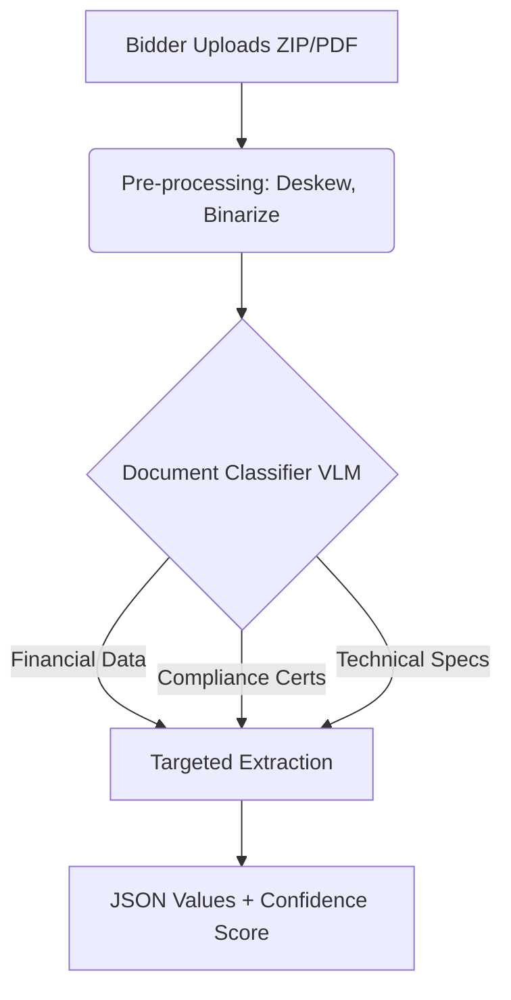
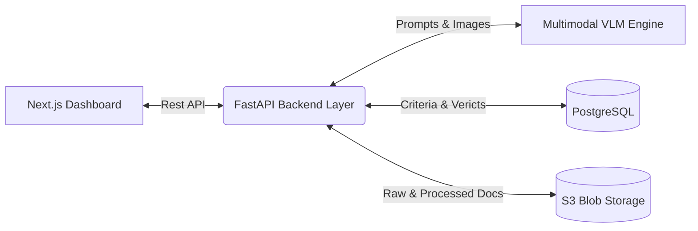

# AI-Based Tender Evaluation and Eligibility Analysis Platform
**Prepared for: Central Reserve Police Force (CRPF) Procurement**

## 1. Executive Summary & Problem Understanding
Government procurement, particularly for critical organizations like the Central Reserve Police Force (CRPF), is governed by strict frameworks (e.g., General Financial Rules - GFR 2017) to ensure transparency, fairness, and competition. Evaluating bids (L1 evaluation pipelines, technical scrutiny) is a high-stakes manual process. 

The challenges are uniquely complex:
* **Zero Margin for Error**: Disqualifying a valid bidder or accepting an invalid one can lead to legal challenges, RTI (Right to Information) queries, and project delays.
* **Heterogeneous Data**: Submissions are a messy mix of pristine digital PDFs, low-quality scans, rotated photographs of old company seals, and uniquely formatted balance sheets.
* **Subjectivity vs. Objectivity**: Human evaluators might interpret the same document differently. 

Our proposed platform transforms this manual grind into an **AI-assisted, deterministic, and fully auditable workflow**. It does not replace the procurement officer; instead, it acts as a hyper-accurate, tireless assistant that pre-processes, matches, and flags issues so the officer can make the final, informed, and legally defensible decision.

## 2. Extracting Eligibility Criteria from Tenders
Tender documents (RFP/NIT) are dense legal documents. To structure this, we employ a **Large Language Model (LLM) with Structured Output (JSON Schema)** combined with a Retrieval-Augmented Generation (RAG) approach for very large tenders.

* **Parsing**: We convert the tender PDF into Markdown using layout-aware parsers (like DocumentAI), preserving tables and hierarchies.
* **Extraction Strategy**: A specialized LLM chain scans the document specifically for eligibility clauses. It forces the output into a strict structure:
  * **Category**: Technical (e.g. ISO certs), Financial (e.g. net worth), Compliance (e.g. GST registration).
  * **Condition Type**: Mandatory (disqualification if unmet) vs. Optional (point-based scoring).
  * **Parameters**: Quantifiable metrics (e.g., Target Turnover Amount in INR).
* **Human Validation**: The extracted criteria list is presented to the procurement officer for a one-click approval/edit before beginning bidder evaluation.

## 3. Parsing Heterogeneous Bidder Submissions
Bidders submit unstructured "data dumps." Our pipeline standardizes this chaos:

1. **Pre-processing layer**: Deskewing, binarization, and OCR optimization (OpenCV + EasyOCR) to clean up noise from scanned copies.
2. **Document Classification / Routing**: An AI classifier categorizes each uploaded file segment (e.g., "Pages 1-3 = Balance Sheet").
3. **Multimodal Extraction**: We deploy **Vision-Language Models (VLMs)** capable of reasoning over images directly to find and extract the specific requested values from within complex tables and varied layouts.

## 4. Evaluation Engine: Matching & Rule Processing
With criteria structured and bidder data extracted, we run a **Bipartite Matching Engine**:
* **Deterministic Rules**: Standard mathematical logic for quantifiable data (extracted Value >= threshold).
* **Semantic Matches**: Vector embeddings for qualitative text (e.g., comparing "Experience in rugged terrains" against past project summaries).
* **Confidence Thresholding**: If an extraction's confidence score is < 95%, or if information is partially missing, the system aborts auto-processing and routes the criterion straight to the **Manual Review** queue.

## 5. Sample Scenario Walkthrough
To contextualize the engine, consider a tender for construction services with four criteria:
1. Minimum annual turnover of ₹5 crore.
2. At least 3 similar projects completed in 5 years.
3. Valid GST registration.
4. ISO 9001 certification.

Ten bidders submit 100+ documents across varied formats (PDFs, Excel, JPEGs). The system processes them seamlessly:
* **6 Bidders (Clearly Eligible)**: The VLM extracts exact numeric and text evidence exceeding thresholds for all criteria across all 6 companies.
* **3 Bidders (Clearly Not Eligible)**: The engine identifies explicit failures (e.g., turnover verified as ₹3.2 Cr). The final report strictly maps the failure to the exact criterion and the exact uploaded document page.
* **1 Bidder (Need Manual Review)**: The uploaded turnover certificate is a highly compressed, rotated scanned photograph. The VLM extraction confidence drops below the acceptable threshold, automatically flagging the bidder for the officer's manual review without silently rejecting them.

## 6. Explainability & Human-in-the-Loop (No Silent Failures)
> [!IMPORTANT]  
> The system operates on a core principle: **Never silently disqualify.**

Every verdict generated is a composite object containing the full audit trail:
* **Verdict**: `Eligible` | `Not Eligible` | `Need Manual Review`
* **Criterion Evaluated**: "Minimum Turnover > ₹5 Cr"
* **Extracted Value**: "₹6.2 Cr"
* **Source Reference**: Deep-link to the bounding box coordinate [x,y,w,h] on the specific page of the specified PDF.
* **Reasoning**: A clear, one-sentence justification.

## 7. Auditability & Compliance
For use in formal CRPF procurement context, the system ensures non-repudiation:
* **Data Immutability**: All documents are hashed (SHA-256) upon entry to guarantee they haven't been tampered with.
* **Event Sourcing**: Every action—from the AI extracting a value to an officer manually overriding a verdict—is appended to an immutable database log.
* **Final Report**: Produces a printable, legally sound PDF matrix of Bidders vs. Criteria signed off by the evaluating committee.

## 8. Architecture Overview

* **Frontend UI**: Next.js / React (Responsive, single-page application focused on side-by-side document review).
* **Backend API**: Python FastAPI (Ideal for async AI operations and parallel bidder processing).
* **Multimodal / Vision AI**: Gemini 1.5 Pro or similar VLM, which is critical for processing heavily scanned, rotated, and heterogeneous bidder documents.
* **Database & Storage**: PostgreSQL + S3 Object Storage (MinIO for on-premise deployments compliant with government data regulations).

## 9. Main Risks, Trade-offs, and Mitigations
> [!WARNING]  
> Key risk factors to address before production deployment.

| Risk | Description | Mitigation Strategy |
| :--- | :--- | :--- |
| **LLM Hallucination** | AI falsely claiming a document exists or inventing numbers. | **Grounding**: AI must provide bounding box coordinates holding the text. If coordinates are invalid, the extraction diverts to Human Review. |
| **Illegible Documents** | Photographs / scans that are too blurry for even humans to read. | **Pre-flight Check**: Images scoring below OCR legibility thresholds are flagged immediately without wasting compute. |
| **Data Privacy** | Cloud usage for sensitive tenders or bidder financials. | **Deployment Architecture**: Options for MeitY empanelled sovereign cloud or on-premise private models. |

## 10. Implementation Plan for Round 2 (Sandbox)
**Assumptions**: A secure sandbox environment and sample/redacted datasets are provided.

1. **Week 1 (Data Foundation & Pre-reqs)**: 
   * Setup local backend, database schema, and S3 bucket integration. 
   * Build document indexing and cleanup pipeline.
2. **Week 2 (Tender Understanding Agent)**: 
   * Engineer the prompt chains for structured criteria extraction from the primary tender. 
   * Build the UI for the officer to view, edit, and approve the mapped criteria.
3. **Week 3 (Bidder Evaluation Engine)**: 
   * Connect the VLM-powered targeted extraction models.
   * Write the core deterministic and semantic matching logic evaluating extractions against the criteria map.
4. **Week 4 (Explainability & Polish)**: 
   * Assemble the robust officer interface (PDF viewer, bounding box highlights, manual override triggers).
   * Refine logging to ensure complete auditability, creating the final exportable dossier.
